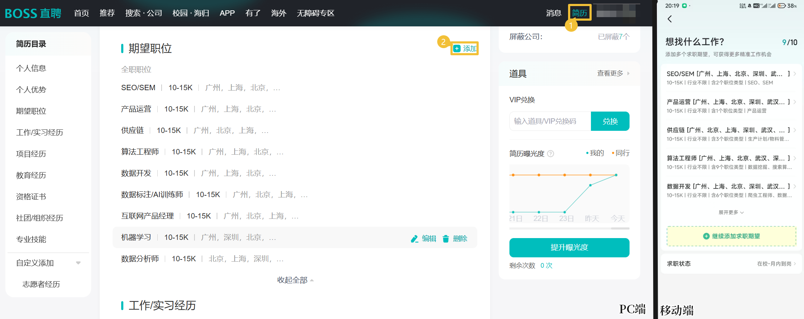

# ReadMe

📖考研失利, 准备春招. 不禁回忆起秋招时投递上百份简历仍颗粒无收的心酸. 

心生一计, 到万能的 Github 上寻找关于自动投递简历的脚本. 找到了[Frrrrrrrrank - auto_job_find_chatgpt_rpa](https://github.com/Frrrrrrrrank/auto_job__find__chatgpt__rpa?tab=readme-ov-file)这个仓库, 将`RAG`和`Langchain`技术用在了`RPA`上, 实现了一个拥有"BOSS直聘求职"的智能体.

本项目参考https://github.com/Frrrrrrrrank/auto_job__find__chatgpt__rpa?tab=readme-ov-file, 原版只能使用OpenAI 的 LLM 和 Embedding 词嵌入模型 API 接口.

本项目则使用 SiliconFlow 硅基流动的 api, 可实现 DeepSeek, Qwen 等 LLM 模型的调用, 同时使用中文领域表现优异的 [M3E 词嵌入模型 🤗](https://huggingface.co/moka-ai/m3e-base). 实现更广泛的LLM模型和词嵌入模型选择.

## 使用方法

1.clone本项目到本地

2.在目录下运行 `pip install -r requirements.txt` 安装所需包

3.在.env文件中配置好 **API 接口**及**秘钥**, **模型全称**, **pdf简历文件路径**(扫描版pdf请自行加入OCR操作)和**岗位名称**

4.运行SeleniumRPA.py

5.在自动打开的boss直聘中扫码登录

---

##  其它琐碎

> 注: 在运行文件前务必先前往官网或APP填写好『求职期望』
> 

---

M3E-base词嵌入Embedding模型两种调用方法: (在线 & 离线)

```Python
from sentence_transformers import SentenceTransformer
# 在线调用
model = SentenceTransformer("moka-ai/m3e-base")

# 将模型下载到本地离线调用
model = SentenceTransformer(model_name_or_path='D:/m3e-base')
```

---

小小脚本, 望能对屏幕前的你有所帮助🏋️
