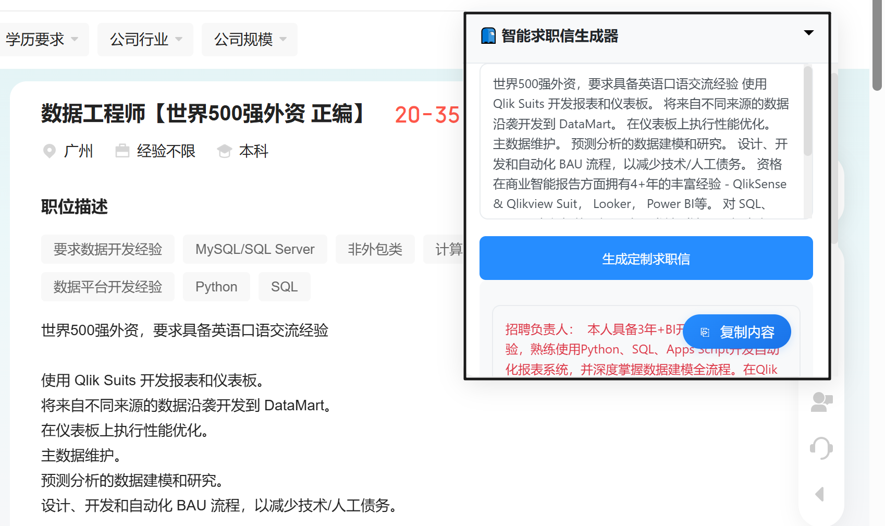

# ReadMe

在BOSS直聘、猎聘等招聘平台实现自动发送简历、自动打招呼等功能，GitHub上已有很多脚本。

但我个人在实际使用中，有以下感受：

- 招聘平台的推荐算法不尽人意。例如我的意向岗位是“数据分析师”，但是BOSS直聘经常给我推荐教培岗；
- LLM生成的话术不尽人意。我明明是本科学历，LLM有时犯傻会说成硕士学历；有时在求职信中还能看到类似“根据您上传的求职要求和个人简历,我来帮您起草一封求职邮件：”的字眼，一眼AI，如果无脑发送的话很容易就会被HR看出来是自动化脚本发送的。

综上，所以个人认为`RPA+LLM`暂时还没那么智能，还不能替我们解决求职全流程的工作：“寻找合适的工作”和“向HR发送求职信”这两个动作还得由人自己来，RPA自动化脚本或是匹配算法暂时还无法取代。

基于以上想法，我开发了这个通过 `油猴脚本 - Flask - Python` 一键生成求职信的脚本。



## 创新点

1. 在招聘网站的岗位详情页面一键即可生成求职信（响应时间取决于使用什么API以及调用什么LLM）
2. 前端使用Langchain困难，通过HTTP API调用本地Python脚本(Flask)
3. 使用 [SiliconFlow 硅基流动](https://cloud.siliconflow.cn/i/akwXG1GV) 的 API, 可实现 DeepSeek, Qwen 等 LLM 模型的调用;
4. 使用中文领域表现优异的 [M3E 词嵌入模型 🤗](https://huggingface.co/moka-ai/m3e-base). 实现更广泛的LLM模型和词嵌入模型选择;

## 使用方法

1.clone本项目到本地

2.在目录下运行 `pip install -r requirements.txt` 安装所需包

3.创建.env文件并在其中配置好 **API 接口**及**秘钥**, **模型**和**pdf简历文件路径**(扫描版pdf请自行加入OCR操作)

```
OPENAI_API_BASE = "https://api.siliconflow.cn/v1"  # API url

OPENAI_API_KEY = "youe own API key"  # API-key

MODEL_NAME = "Qwen/QwQ-32B"  # "Qwen/Qwen2.5-32B-Instruct", "deepseek-ai/DeepSeek-R1"等

CV_PATH = "C:\\Users\\11938\\Desktop\\Resume\\Resume.pdf"  # PDF简历路径
```

4.将`智能求职信生成器-5.2.0.user.js`中的代码粘贴进油猴脚本的代码编辑器里面

5.在目录下运行`Python AccessLLM.py`

6.打开网站即可

##  其它琐碎

M3E-base词嵌入Embedding模型两种调用方法: (在线 & 离线)

```Python
from sentence_transformers import SentenceTransformer

model = SentenceTransformer("moka-ai/m3e-base")  # 在线调用

model = SentenceTransformer(model_name_or_path='D:/m3e-base')  # 将模型下载到本地离线调用
# 推荐镜像 https://gitcode.com/mirrors/moka-ai/m3e-base/tree/main
```

## 参考

1. [Frrrrrrrrank - auto_job_find_chatgpt_rpa](https://github.com/Frrrrrrrrank/auto_job__find__chatgpt__rpa?tab=readme-ov-file) 将`RAG`和`Langchain`技术用在了`RPA`上, 实现了一个拥有"BOSS直聘求职"的智能体；
2. https://github.com/Frrrrrrrrank/auto_job__find__chatgpt__rpa?tab=readme-ov-file, 但是原版只能使用OpenAI 的 LLM 和 Embedding 词嵌入模型 API 接口.

---

小小脚本, 望能对屏幕前的你有所帮助🏋️
